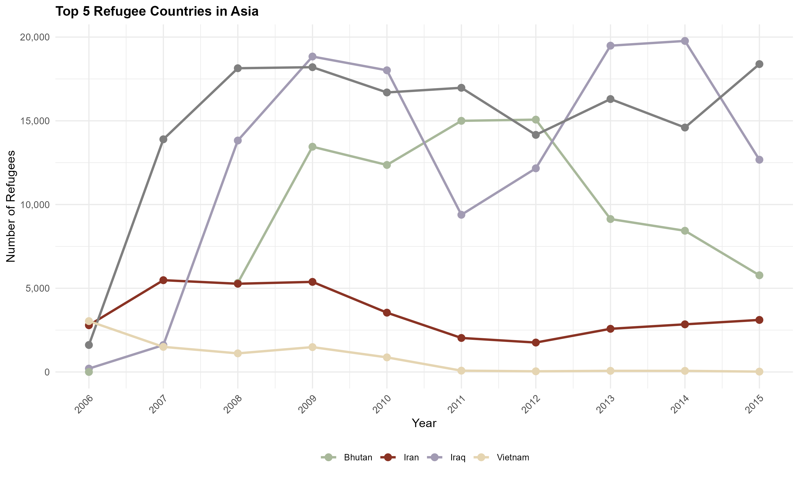

### Team Members:  

Abi Joshua GEORG / Eri Yoshimoto / Hakeem GARCIA \newline
Nattida TAVAROJN / Neha NAGABHUSHAN / Weikang YANG

### Visualization #1: Refugee Number by Continent (Stacked Bar Chart)

This illustration represents the flow of refugee admissions into the United States, from 2006 through 2015, by continent of origin. It also overlays U.S. presidential terms on top to explore possible correlation between trends of refugee admission and which political administration it falls under. The stacked bar graph also shows the shifting regional composition of refugees through time, and the background shading distinguishes between the presidencies of George W. Bush and Barack Obama.

**Key findings from the chart:**\newline

- Refugee admissions increased greatly from 2006 to 2009, at the end of the Bush presidency and the start of the Obama presidency.\newline
- Asia was constantly the leading source region for refugees, Africa is the second source region.\newline
- The number of refugees declined in 2011 but stabilized in subsequent years.\newline
- By overlaying the presidential terms, the chart sparks a debate on whether U.S. refugee policy shifts align with changes in political leadership.\newline

**CRAP:**\newline
- Contrast: It is shown with different colors used to distinguish continents for clarity of regional differences, while the background shading further contrasts the presidential terms.\newline
- Repetition: Bars follow a uniform format every year; this makes trends easier to identify.\newline
- Alignment: The visualization has kept a clear timeline along the x-axis, matching presidential terms with refugee numbers for ease of interpretation.\newline
- Proximity: The legend is placed close to the visualization, in order to ensure accessibility without cluttering the main chart.\newline

**Kieran Healy’s principles:**\newline
- Truthfulness: The visualization accurately represents refugee trends using reliable government data.\newline
- Functionality: The stacked bar format allows for a comparative view of continental refugee distribution while maintaining readability.\newline
- Beauty: The chart has a well-balanced color scheme and grid layout which improves clarity.\newline
- Insightfulness: The overlay of presidential terms provides additional context, making viewers consider the role of political leadership in shaping refugee admissions.\newline
- Enlightenment: This visualization encourages critical thinking about policy trends and regional shifts in global refugee movements.\newline
 
### Visualization #2: Top 5 Refugee countries by Continent (For all 4 Line Graphs)

These graphs represent the top refugee sending countries of Asia, Africa, North America, and Europe for the period from 2006 to 2015. The following line graph outlines refugees from different countries over ye.

**Key Findings from the Chart:**\newline
- Asia: In the line graph, Iraqi and Burmese refugees show large sending without any reduction. Bhutan's trend line also increased rapidly, peaking in around 2008-2010.\newline
- Africa: Somalia initially provided the largest number of refugees but decreased; Eritrea and Congo, however, had increased numbers towards the end.\newline
- North America: Cuba had significantly higher numbers compared to Haiti and Honduras, yet with a steady though fluctuating trend.\newline
- Europe: Ukraine and Russia had significant initial numbers of refugees, yet general trends are showing a continued decrease.\newline

**CRAP:**\newline
 - Contrast: Every country has its color, and so they would be differentiated. 
 - Repetition: All four graphs follow the same layout, making comparisons easier.
 - Alignment: The x-axis represents time from 2006 to 2015, making sure chronological order is consistent. 
 - Proximity: Legend of all 4 visualizations are placed near the graphs to increase readability.

 **Kieran Healy’s Principles:**\newline
- Simplicity & Clarity: The focus is only on the top five countries per continent and hence it reduces clutter and enhances readability.\newline
- Effective Use of Space: The line graphs provide a clear representation of trends without too many overwhelming details.\newline
- Comparative Analysis: By presenting multiple continents separately, each visualization tells a unique but related story.\newline
 
 
### Visualization #3: Refugee Numbers for Top Countries (Line Graph)

This visualization is a line graph showing the refugee population from top contributing countries into the U.S. between the period of 2006-2015 and also shows variation in refugee arrivals from Bhutan, Burma, Cuba, Iraq, Iran, Russia, and Somalia over a period of time.\newline

**Key Findings from the Chart:**\newline
- Burma and Iraq had the highest influx in refugees, with peaks in 2008 and 2014, respectively.\newline
- Somalia and Bhutan showed steady refugee movement, with a resurgence in Bhutanese refugee numbers after 2011.\newline
- Russia and Iran had comparatively lower numbers, showing a decline over time.\newline

- Cuba’s trend remained relatively stable, with minor fluctuations.\newline
- The data suggests that geopolitical events and conflicts significantly influenced refugee resettlement trends.\newline

**CRAP:**\newline
- Contrast: Each country is represented by a unique color, ensuring clear differentiation.\newline
- Repetition: The consistent line thickness and spacing across countries improve readability.\newline
- Alignment: The x-axis represents time, ensuring an easy-to-follow chronological progression.\newline
- Proximity: The legend is placed below the graph, making it easy to reference without crowding the visualization.\newline
 
**Kieran Healy’s Principles:**\newline
- Simplicity & Clarity: The top refugee-contributing countries are selected for focus, making the chart informative without excessive detail.\newline
- Effective Use of Space: Using the line graph ensures a clear visualization of trends without overlapping data points.\newline
- Comparative Analysis: This chart allows for direct comparisons across countries to understand any variations in refugee movements over time.\newline
 
### Visualization #4: Number of Refugees for each country in each year (HEATMAP)

This heat map displays refugee admissions from various countries between the 2006 and 2015 period, where the shading intensity represents the number of refugees. Darker shade indicates fewer refugees, while lighter shades highlight higher refugee numbers.\newline
 
**Key Findings from the Chart:**\newline
- This visualization reveals patterns of refugee movement from different countries over time.\newline
- Countries like Burma, Iraq, and Somalia consistently have higher refugee numbers, as indicated by the lighter-colored rows.\newline
- Periods of significant influx align with major geopolitical crises or policy changes.\newline
- Some countries exhibit sporadic peaks, reflecting temporary surges in refugee resettlement.\newline
- Countries with consistently dark shading contribute very few refugees to the U.S.\newline
 
**CRAP:**\newline
- Contrast: The gradient color scale enhances readability, showing clear differentiation between high and low refugee numbers.\newline
- Repetition: The consistent structure of country names and time intervals ensures clarity across the data set.\newline
- Alignment: The x-axis represents years, while the y-axis lists countries, which follows a left-to-right, top-to-bottom reading order.\newline
- Proximity: The legend is placed to the right, making sure that the focus is on the heatmap while allowing for easy interpretation.\newline
 
**Kieran Healy’s Principles:**\newline
- Comparative Focus: This heat map allows an immediate visual comparison between different countries and time periods.\newline
- Effective Use of Space: By using light and dark color gradients, the visualization efficiently describes large amounts of information without overwhelming the viewer.\newline
- Layering & Separation: The color scale helps differentiate refugee intensity and prevents cluttering while also maintaining a structured presentation.\newline
- Visual Hierarchy: Brighter colors naturally draw attention to key data points (countries with the highest refugee numbers).\newline
- Simplicity & Clarity: The heatmap eliminates unnecessary visual clutter, avoiding excessive numerical values while keeping the focus on trends.\newline
- Proportionality: Each row is proportional to the number of countries, ensuring fair representation without distorting information.\newline
 
### Visualization #5: Global Refugees Map (GIF)

This animated global refugee map visualizes the number of refugees admitted into the U.S. from various countries for year-by-year periods in the range between 2006 to 2015. This map highlights the geographic origins of refugees and describes how refugee admissions changed over time.\newline

**Key Findings from the Chart:**\newline
- Continuous refugee flows from conflict-prone regions: Countries in the Middle East, for instance, Iraq and Syria; Africa-for example, Somalia, Sudan, DR Congo; Asia-for example, Burma, Bhutan, have remained consistent sources of refugees.\newline
- Temporal fluctuation in the number of refugees across years is depicted by different shades for different years, sometimes mirroring geopolitical events, changing U.S. immigration policies, and humanitarian crises.\newline
- Regional Patterns: Some regions appear to retain the darker shade continuously, such as the Middle East and parts of Africa, signaling a sustained outflow of refugees.\newline
- Spikes and declines by notable amplitudes: The flux of refugees from a specific country speaks to changes in policy or increased conflations like for example, refugees from Syria and Iraq increased after 2011.\newline

**CRAP:**\newline
- Contrast: There is a variation in refugee number presentation; a gradient color scale provides darker shade for higher values. This way, areas that have high refugee admissions really pop.\newline

- Repetition: The color scale and map layout are the same in every frame for consistency and ease of comparison through time. The legend is in the same position to maintain user familiarity.\newline

- Alignment: The map, title, and legend are aligned, making the layout clean and professional. The timeline progression is logical and, therefore, easy to interpret through the animation.\newline

- Proximity: The legend is placed close to the visualization, without overlapping it, for the viewers to reach the color gradient without hassle in case they are looking into the trends. Logical grouping of countries is followed by keeping the geographical relevance intact.\newline

**Kieran Healy's Principles:**\newline
- Truthful: No distortion of data, and there are no misleading visuals. There is one-to-one correspondence in color intensity with regard to the number of refugees.\newline
- Functional: The animated format supports the story-telling as the user has a sense of observing changes through time rather than seeing a static snapshot. Color scale is effective without numerical labels required for each and every country on relative magnitudes.\newline
- Beautiful: The visual aesthetic is pleasing on the eyes and has an appropriate color palette. The animation element is engaging without being distractive.\newline
- Elucidating: The visualization shows the hidden trends in how geopolitical crises surge refugees from specific countries into lighter shade. Users can, at a glance, identify which regions constantly contribute to the high number of refugees.\newline

